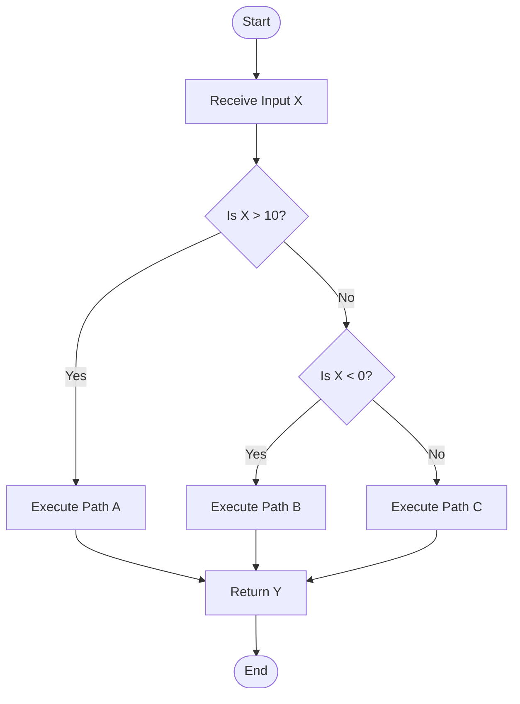
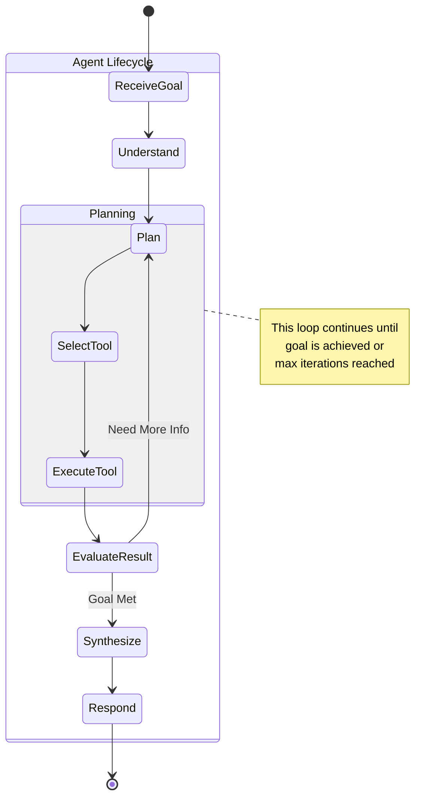
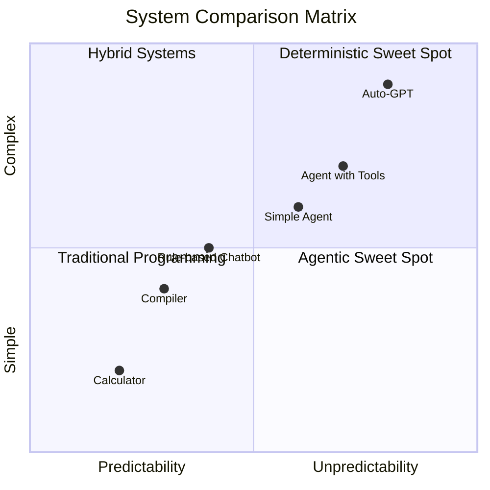
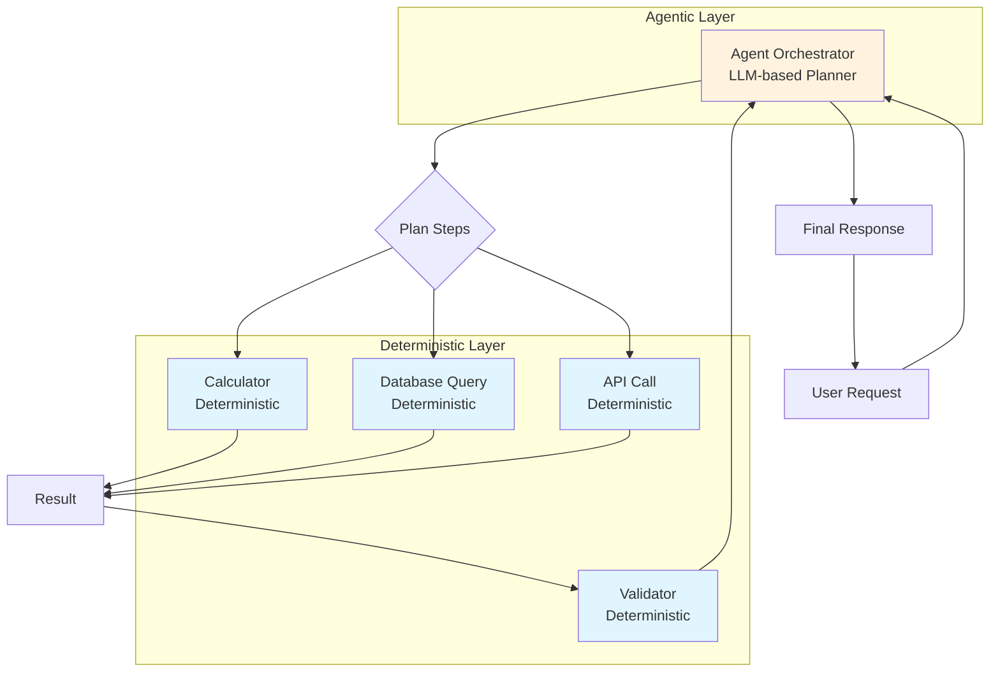
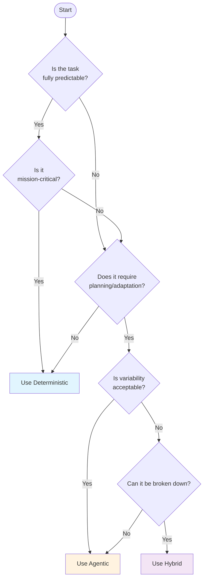

# Deterministic vs Agentic Systems

This chapter explores the fundamental differences between deterministic and agentic approaches in software design, particularly in the context of AI and automation.

## Overview

In the landscape of modern software development, especially when integrating Large Language Models (LLMs), two distinct architectural paradigms emerge: **Deterministic** and **Agentic** systems. Understanding the trade-offs between these approaches is crucial for designing robust, reliable, and intelligent applications.

## Deterministic Systems

A deterministic system is one where the output is entirely predictable and consistent based on the input and the defined rules. There is no randomness or variation in the outcome.

### Key Characteristics

- **Predictability:** Given the same input, the system will *always* produce the same output
- **Rule-Based:** Operates on explicit, hardcoded logic (e.g., `if-then-else` statements, mathematical formulas)
- **Reliability:** Behavior can be precisely defined and tested with 100% certainty
- **Transparency:** The decision-making path is clear and traceable

### Visual Representation

```mermaid
graph LR
    A[Input: 5 + 3] --> B[Deterministic Function: add()]
    B --> C[Output: 8]
    
    D[Input: 5 + 3] --> E[Deterministic Function: add()]
    E --> F[Output: 8]
    
    style B fill:#e1f5fe
    style E fill:#e1f5fe
```

### Code Example

```python
def add_numbers(a, b):
    """
    Deterministic function: same input always yields the same output.
    
    Args:
        a: First number
        b: Second number
    
    Returns:
        Sum of a and b
    """
    return a + b

# Example usage demonstrating determinism
result1 = add_numbers(5, 3)  # Always returns 8
result2 = add_numbers(5, 3)  # Always returns 8

print(f"First call result: {result1}")
print(f"Second call result: {result2}")
print(f"Results are equal: {result1 == result2}")  # Always True
```

### Flowchart of Deterministic Decision Making



### When to Use Deterministic Systems

| Use Case | Example | Why Deterministic? |
|----------|---------|-------------------|
| **Mission-Critical Logic** | Financial calculations, braking systems in cars | Failure is not an option; must be predictable |
| **Data Validation** | Ensuring data conforms to a specific schema | Rules are clear and unchanging |
| **Simple Tasks** | Calculator operations, string manipulation | All scenarios can be anticipated |

---

## Agentic Systems

An agentic system, in contrast, uses the reasoning capabilities of Large Language Models (LLMs) to determine its own path toward a goal. It is characterized by autonomy and the ability to handle ambiguity.

### Key Characteristics

- **Goal-Oriented:** The user provides a high-level goal, and the agent decides the steps to achieve it
- **Variable Outputs:** Given the same prompt or goal, the system may take different actions or produce different responses
- **Tool Use:** Agents can decide which external tools to call to gather information or take action
- **Adaptability:** Can handle novel or ambiguous situations by reasoning through them

### Agent Architecture Diagram

```mermaid
flowchart TD
    User[User Goal: "Book flight to London"] --> Agent[Agent Brain<br/>LLM Core]
    
    Agent --> Plan{Planning Loop}
    
    Plan --> Decide[Decide Next Action]
    Decide --> Action{Action Type}
    
    Action -->|Information Need| Tool1[Search Web]
    Action -->|Computation| Tool2[Run Code]
    Action -->|External Service| Tool3[Call API]
    Action -->|Complete| Respond[Provide Answer]
    
    Tool1 --> Observe[Observe Result]
    Tool2 --> Observe
    Tool3 --> Observe
    
    Observe --> Evaluate{Goal Met?}
    Evaluate -->|No| Plan
    Evaluate -->|Yes| Respond
    
    Respond --> Complete[Goal Complete]
    
    style Agent fill:#fff3e0
    style Tool1 fill:#e8f5e8
    style Tool2 fill:#e8f5e8
    style Tool3 fill:#e8f5e8
```

### Code Example

```python
import random
from typing import Dict, List
import time

class SimpleAgent:
    """
    A simplified example of an agentic system that shows variable behavior.
    """
    
    def __init__(self, goal: str):
        self.goal = goal
        self.tools = {
            "search": self.search_web,
            "calculate": self.calculate,
            "remember": self.recall_memory
        }
        self.memory = []
    
    def search_web(self, query: str) -> str:
        """Simulate web search"""
        results = {
            "weather": "Sunny, 72°F",
            "stock price": "$150.23",
            "definition": "A concept or idea"
        }
        return results.get(query.lower(), f"Found information about: {query}")
    
    def calculate(self, expression: str) -> float:
        """Simple calculator"""
        try:
            return eval(expression)
        except:
            return 0.0
    
    def recall_memory(self, key: str) -> str:
        """Check memory for stored information"""
        for item in self.memory:
            if key in item:
                return item[key]
        return "No memory found"
    
    def reason_about_next_action(self, context: Dict) -> str:
        """
        Simulate LLM reasoning - note the variability!
        This mimics how an LLM might choose different paths.
        """
        # Simulate different reasoning paths
        paths = [
            "I should search for more information",
            "Let me calculate that first",
            "I remember something about this",
            "I think I have enough information"
        ]
        
        # Add some randomness to simulate variable LLM outputs
        thought = random.choice(paths)
        
        # Store in memory
        self.memory.append({f"thought_{len(self.memory)}": thought})
        
        return thought
    
    def execute(self) -> str:
        """Run the agent"""
        print(f"Agent Goal: {self.goal}")
        print("-" * 40)
        
        steps_taken = []
        max_steps = 5
        step_count = 0
        
        while step_count < max_steps:
            step_count += 1
            
            # Agent reasons about what to do next
            thought = self.reason_about_next_action({
                "goal": self.goal,
                "steps_taken": steps_taken
            })
            
            print(f"Step {step_count}: {thought}")
            steps_taken.append(thought)
            
            # Simulate taking action based on thought
            if "search" in thought.lower():
                result = self.search_web(self.goal)
                print(f"  → Search result: {result}")
            elif "calculate" in thought.lower():
                result = self.calculate("2 + 2")
                print(f"  → Calculation result: {result}")
            elif "remember" in thought.lower():
                result = self.recall_memory("thought")
                print(f"  → Memory recall: {result}")
            else:
                # Might decide to respond
                print(f"  → Final response: I've completed the goal: {self.goal}")
                return f"Completed: {self.goal}"
            
            time.sleep(0.5)  # Simulate processing time
        
        return f"Goal processing complete: {self.goal}"

# Run the same agent multiple times to see variability
print("=" * 50)
print("AGENT EXECUTION 1")
print("=" * 50)
agent1 = SimpleAgent("Find weather information")
result1 = agent1.execute()

print("\n" + "=" * 50)
print("AGENT EXECUTION 2 - SAME GOAL")
print("=" * 50)
agent2 = SimpleAgent("Find weather information")
result2 = agent2.execute()
```

### State Machine for Agent Behavior



### When to Use Agentic Systems

| Use Case | Example | Why Agentic? |
|----------|---------|--------------|
| **Complex Workflows** | Research assistant gathering data from multiple sources | Requires dynamic planning and adaptation |
| **Open-Ended Problems** | "Create a marketing strategy" | No single correct solution; needs creativity |
| **Natural Language** | Customer service chatbot | Must understand varied human expressions |
| **Dynamic Environments** | Stock trading assistant | Conditions change constantly |

---

## Comparison Matrix



## Detailed Comparison Table

| Feature | Deterministic System | Agentic System |
|:---|:---|:---|
| **Core Logic** | Hardcoded rules and algorithms | LLM-based reasoning and planning |
| **Output** | Fixed and predictable | Variable and dynamic |
| **Predictability** | High (same input, same output) | Low (can vary even with same goal) |
| **Testing** | Straightforward (unit tests, assertions) | Complex (requires evaluation of goal completion) |
| **Error Handling** | Pre-defined for known scenarios | Can attempt to reason through novel errors |
| **Development Time** | Longer for complex scenarios | Faster for complex scenarios |
| **Debugging** | Easy - step through code | Difficult - reasoning path varies |
| **Resource Usage** | Low - just computation | High - LLM API calls, more processing |
| **Best For** | Simple, repeatable, critical tasks | Complex, ambiguous, goal-oriented tasks |
| **Example** | Banking transaction processor | AI research assistant |

## Hybrid Architecture Example

Most real-world applications use a hybrid approach:



### Hybrid Implementation

```python
from typing import Any, Dict
import json

class HybridSystem:
    """
    Example of a hybrid system combining deterministic and agentic approaches.
    """
    
    def __init__(self):
        # Deterministic components
        self.validators = self._init_validators()
        self.calculators = self._init_calculators()
        
        # Agentic component
        self.planner = self._init_planner()
    
    def _init_validators(self) -> Dict:
        """Deterministic validation rules"""
        return {
            "email": lambda x: "@" in x and "." in x,
            "phone": lambda x: x.replace("-", "").isdigit() and len(x) >= 10,
            "age": lambda x: 0 <= x <= 150
        }
    
    def _init_calculators(self) -> Dict:
        """Deterministic calculators"""
        return {
            "add": lambda a, b: a + b,
            "multiply": lambda a, b: a * b,
            "discount": lambda price, pct: price * (1 - pct/100)
        }
    
    def _init_planner(self):
        """Simulated agentic planner"""
        return {
            "name": "PlanningAgent",
            "capabilities": ["plan", "reason", "decide"]
        }
    
    def validate_input(self, data_type: str, value: Any) -> bool:
        """Deterministic validation"""
        if data_type in self.validators:
            return self.validators[data_type](value)
        return False
    
    def calculate(self, operation: str, *args) -> float:
        """Deterministic calculation"""
        if operation in self.calculators:
            return self.calculators[operation](*args)
        raise ValueError(f"Unknown operation: {operation}")
    
    def plan_task(self, goal: str, context: Dict) -> str:
        """
        Agentic planning - simulates LLM deciding the approach.
        In reality, this would call an LLM API.
        """
        # Simulate planning logic
        plan = f"""
        Planning for goal: {goal}
        Context: {json.dumps(context, indent=2)}
        
        Steps identified:
        1. Validate all inputs using deterministic validators
        2. Perform necessary calculations
        3. Combine results
        4. Validate final output
        """
        return plan
    
    def execute_task(self, goal: str, inputs: Dict) -> Dict:
        """Execute a task using hybrid approach"""
        results = {}
        
        # Step 1: Agentic planning
        print("🤖 Agentic Planning Phase:")
        plan = self.plan_task(goal, {"inputs": inputs})
        print(plan)
        
        # Step 2: Deterministic execution based on plan
        print("\n⚙️ Deterministic Execution Phase:")
        
        # Validate inputs
        for key, value in inputs.items():
            if key in ["email", "phone", "age"]:
                is_valid = self.validate_input(key, value)
                results[f"{key}_valid"] = is_valid
                print(f"  Validating {key}: {is_valid}")
        
        # Perform calculations
        if "price" in inputs and "discount" in inputs:
            final_price = self.calculate(
                "discount", 
                inputs["price"], 
                inputs["discount"]
            )
            results["final_price"] = final_price
            print(f"  Calculated final price: ${final_price}")
        
        # Step 3: Agentic synthesis
        print("\n🤖 Agentic Synthesis:")
        synthesis = f"Task completed successfully. Results: {results}"
        results["summary"] = synthesis
        print(synthesis)
        
        return results

# Example usage
hybrid = HybridSystem()

task_inputs = {
    "email": "user@example.com",
    "age": 25,
    "price": 100.00,
    "discount": 20
}

print("=" * 60)
print("HYBRID SYSTEM EXECUTION")
print("=" * 60)
final_results = hybrid.execute_task("Calculate discounted price", task_inputs)
```

## Decision Framework



## Conclusion: Choosing the Right Approach

The choice between deterministic and agentic systems is not about which is "better," but about which is the right tool for the job.

### Key Takeaways

1. **Deterministic systems** excel at:
   - Repeatable, predictable tasks
   - Mission-critical operations
   - High-volume, low-complexity operations

2. **Agentic systems** excel at:
   - Complex, multi-step tasks
   - Handling ambiguity
   - Tasks requiring reasoning and adaptation

3. **Hybrid systems** offer the best of both worlds:
   - Agentic orchestration
   - Deterministic execution
   - Safety and reliability where needed

### Final Thought

> "Use deterministic systems for the parts of your application that need to be reliable, predictable, and testable. They form the solid foundation upon which more complex systems can be built. Use agentic systems to add a layer of intelligence and flexibility, allowing your application to tackle complex goals that would be impossible to pre-program."

### Further Reading

- [LLM Agents: Building Autonomous AI](https://example.com)
- [Deterministic vs Stochastic Systems in Computer Science](https://example.com)
- [Hybrid Architectures in Modern AI Applications](https://example.com)